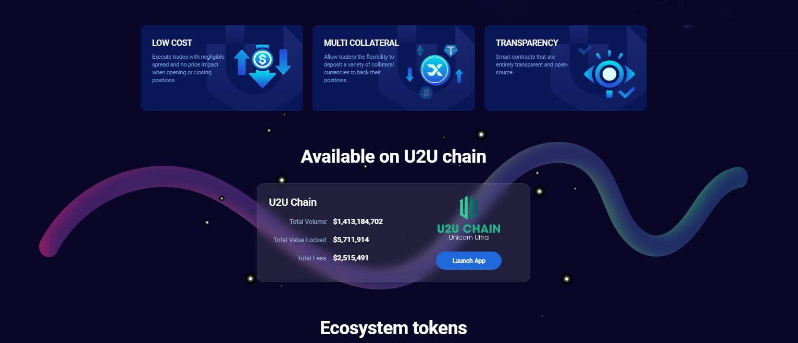

# EVM Chain Platform

The **EVM Chain Platform** is a decentralized finance (DeFi) ecosystem built for trading, staking, liquidity provision, and token management. It is designed as a decentralized exchange (DEX) with future integration of an Automated Market Maker (AMM) mechanism for seamless on-chain trading within the EVM network.

---

## 🚀 Features

### 🔄 Trading System
- Real-time token price charts
- Trading history and wallet position tracking
- Buy/Sell orders with leverage options
- Support for major tokens (ETH, USDT, BTC, BNB)

### 📊 Dashboard
- 24h trading volume tracking
- Open interest overview
- Long/short position analysis
- Liquidity pool statistics
- Governance tokens: **UTX** and **ULP**
- ULP/UTX index composition insights

### 💰 Earn (Staking & Farming)
- Stake **UTX** and **ULP** tokens to earn rewards (esUTX)
- Claimable rewards dashboard
- Pool statistics (APR, total staked, multipliers)
- Vault vesting system for reward conversion and withdrawals

### 🛒 Buy Module
- Buy UTX and ULP tokens directly
- Support for decentralized and centralized exchanges
- Automated token allocation from platform fees:
  - **UTX:** 30% of platform fees (utility + governance)
  - **ULP:** 70% of platform fees (liquidity provider token)

---

## 🖼️ Screenshots




---

## ⚙️ Installation & Setup

### 1. Clone the repository
```bash
git clone https://github.com/ProgrammingGeekDeveloper/demo1.0.git
cd demo1.0